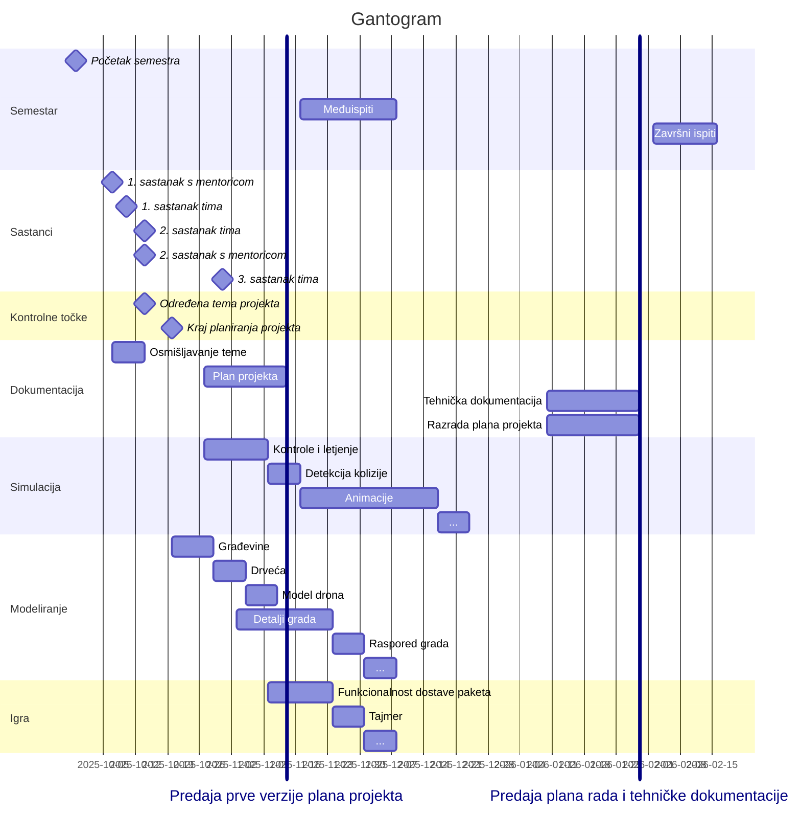

### **Dron.co**

---

- Simulacija
	- [x] kontrole
	    - [x] kontroler
	    - [ ] tipkovnica
	- [x] letjenje
    - [ ] detekcija kolizije
	- [ ] animacija
	    - [ ] rotiranje propelera
	    - [ ] glatke kontrole
	        - [x] kamera
	        - [ ] translacija
	        - [ ] rotacija
	    - [ ] naginjanje pri kretanju/skretanju
- Modeliranje
    - [ ] za grad
        - [x] podloge grada
        - [x] građevine
        - [ ] okolina grada (brda)?
        - [ ] drveća
        - [ ] detalji
        - [ ] raspored grada
	- [ ] za igranje
        - [ ] model drona
        - [ ] prepreke za dron
        - [ ] postaja za dron
- Igra
	- [ ] dostavljanje paketa
	- [ ] tajmer
	- [ ] granice mape
	- [ ] death mechanic
	- [ ] scoreboard?
	- [ ] punjenje baterije?
- Dokumentacija
	- [ ] Plan projekta
	- [ ] Tehnička dokumentacija

---

>[!NOTE]
>https://mermaid.js.org/syntax/gantt.html

---

