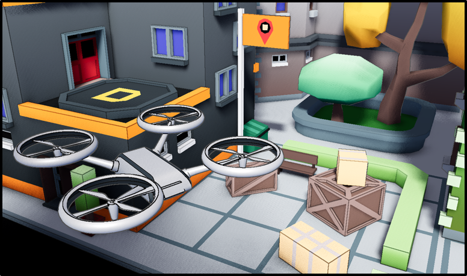

---

### **Dron.co**

Small game made in Godot where the player's goal is to deliver packages in a town by flying a drone. Created by a team of 5 students for a university project.

---

### Keyboard controls

<table>
    <tr>
        <th>Key</th>
        <th>Description</th>
    </tr>
    <tr>
        <td><kbd>W/S</kbd></td>
        <td>move forward/backward</td>
    </tr>
    <tr>
        <td><kbd>A/D</kbd></td>
        <td>rotate left/right</td>
    </tr>
    <tr>
        <td><kbd>Q/E</kbd></td>
        <td>strafe left/right</td>
    </tr>
    <tr>
        <td><kbd>Space/Ctrl</kbd></td>
        <td>up/down</td>
    </tr>
    <tr>
        <td><kbd>Click</kbd></td>
        <td>drop package</td>
    </tr>
    <tr>
        <td><kbd>Esc</kbd></td>
        <td>exit</td>
    </tr>
</table>

---

### References

> Research
> - Godot Docs: https://docs.godotengine.org/en/stable/
> - Godot Shaders: https://godotshaders.com/
> - Gantt tool: https://www.mermaidchart.com/play?utm_source=mermaid_live_editor
> - Mermaid Docs: https://mermaid.js.org/syntax/gantt.html
> - WBS tool: https://online.visual-paradigm.com/diagrams/features/work-breakdown-structure-software/
> 
> Assets
> - Outline shader (MIT Lisence): https://godotshaders.com/shader/sobel-outline-shader/
> - Skybox (Royalty Free License): https://freestylized.com/skybox/sky_22/
> - Font (SIL Open Font License, Version 1.1): https://fonts.google.com/specimen/Jersey+15?categoryFilters=Appearance:%2FTheme%2FPixel
> - Water shader (CC0 1.0 Universal License): https://godotshaders.com/shader/absorption-based-stylized-water/

---

