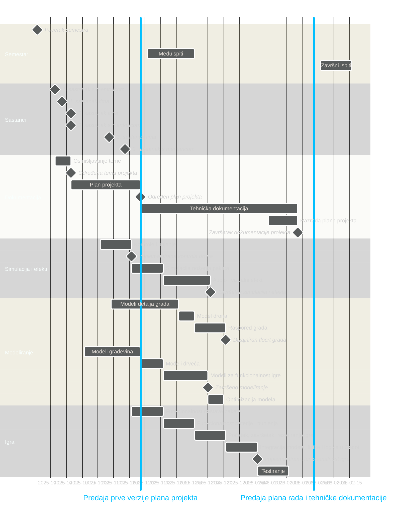
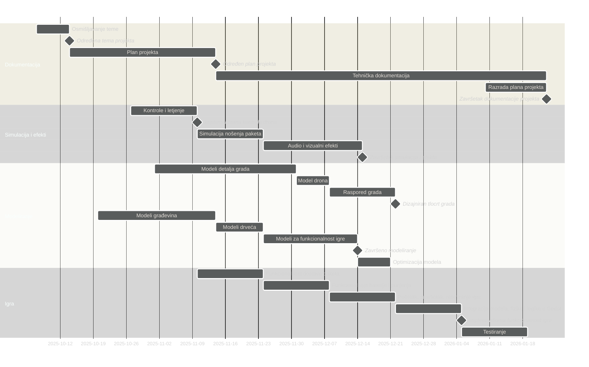

### **Dron.co**

---

### Funkcionalnosti

- Simulacija
	- [x] kontrole
	    - [x] kontroler
	    - [x] tipkovnica
    - [x] kolizija
    - [ ] simulacija paketa
    - [ ] vjetar
- Efekti
    - [ ] Vizualni
        - [ ] rotiranje propelera
        - [x] responzivne kontrole
            - [x] glatka kamera
            - [x] glatko kretanje
            - [x] naginjanje pri kretanju/skretanju
        - [ ] Korisničko sučelje
            - [ ] Baterija
            - [ ] Title screen
            - [ ] Death screen
    - [ ] Audio
        - [ ] Zvuk motora drona
- Modeliranje
    - [ ] za grad
        - [x] podloge grada
        - [x] građevine
        - [ ] drveća/grmlje
        - [ ] detalji grada
            - [ ] ulična rasvjeta
            - [ ] prometni znakovi
            - [ ] semafor
            - [ ] kante i kontejneri za smeće
            - [ ] štandovi
            - [ ] klupe
            - [ ] ...
        - [ ] raspored grada
	- [ ] za igranje
        - [ ] model drona
        - [ ] modeli paketa
        - [ ] prepreke za dron
        - [ ] postaja za dron
- Igra
	- [ ] dostavljanje paketa
        - [ ] mjesto pokupljanja paketa
        - [ ] točke dostavljanja paketa
	- [ ] death mechanic
        - [ ] sudar
        - [ ] prazna baterija
	    - [ ] granice mape ("no signal")
	- [ ] mjerenje vremena dostavljanja paketa
	- [ ] baterija
        - [ ] pražnjenje baterije
	    - [ ] punjenje baterije
	- [ ] navigacija igraća
	    - [ ] markeri za dostavu
- Dokumentacija
	- [ ] Plan projekta
	- [ ] Tehnička dokumentacija

---

### Linkovi

> Alat za Gantt: https://www.mermaidchart.com/play?utm_source=mermaid_live_editor

> Dokumentacija za Mermaid: https://mermaid.js.org/syntax/gantt.html

> Alat za WBS: https://online.visual-paradigm.com/diagrams/features/work-breakdown-structure-software/

---

### Gantogram v1.0 (za planiranje)

---

### Gantogram v2.0 (za dokument)

>[!NOTE]
>Upute za export grafa u sliku
>
>1. Kopirati source kod grafa (sve unutar "mermaid" bloka)
>2. https://www.mermaidchart.com/play?utm_source=mermaid_live_editor
>3. `theme: neutral`
>4. Export

---

### WBS Dijagram

---

