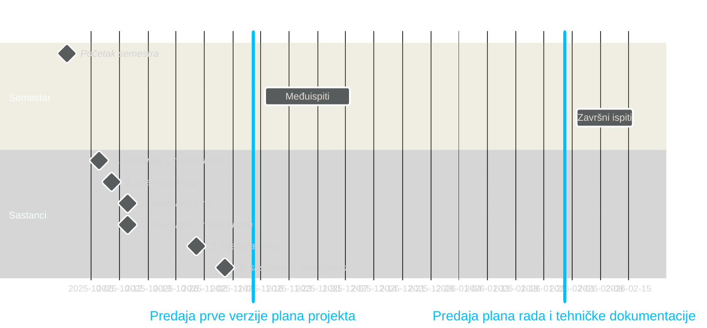
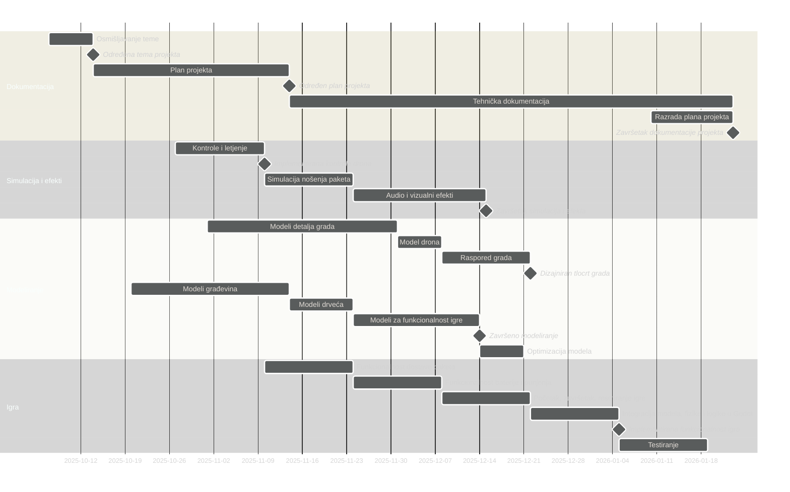
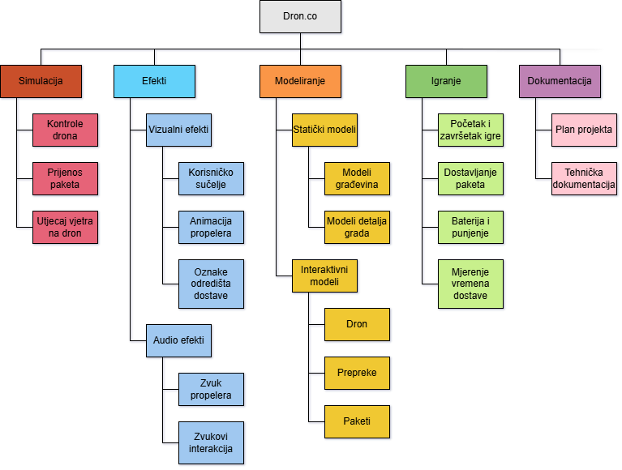

### **Dron.co**

---

### Funkcionalnosti

- Simulacija
	- [x] letjenje (kontroler, tipkovnica) `[leon, stjepan]`
    - [x] kolizija `[leon, stjepan]`
    - [x] nošenje paketa `[jakov]`
    - [ ] efekt vjetra `[?]`
- Efekti
    - [x] "responzivne" kontrole (smooth kamera, smooth kretanje, naginjanje pri kretanju) `[stjepan]`
    - [x] stilski efekti (post processing, nebo) `[martin]`
    - [ ] rotiranje propelera `[?]`
    - [ ] audio efekti (dron, alarm, pokupljanje paketa...) `[?]`
- Modeliranje
    - [x] podloge grada `[martin]`
    - [x] građevine `[martin]`
    - [x] drveća `[martin]`
    - [x] modeli paketa `[martin]`
    - [x] glavna postaja, punjač `[martin]`
    - [ ] detalji grada (ulična rasvjeta, semafori, štandovi, klupe, vozila...) `[?]`
    - [ ] raspored grada `[?]`
    - [ ] model drona `[?]`
- Gameplay
	- [ ] dostavljanje paketa `[?]`
    - [ ] korisničko sučelje (title screen, baterija, vrijeme, death screen) `[martin]`
	- [ ] baterija `[martin]`
	- [ ] štopanje dostavljanja paketa `[?]`
	- [ ] death mechanic (sudar, prazna baterija, granice mape "no signal") `[?]`
	- [ ] oznake dostave (neki nacin da se zna kamo treba dostaviti) `[martin]`
- Dokumentacija 
	- [x] Plan projekta
	- [ ] Tehnička dokumentacija

---

### Linkovi

> [!NOTE]
> Alati
> - Alat za Gantt: https://www.mermaidchart.com/play?utm_source=mermaid_live_editor
> - Dokumentacija za Mermaid: https://mermaid.js.org/syntax/gantt.html
> - Alat za WBS: https://online.visual-paradigm.com/diagrams/features/work-breakdown-structure-software/
> 
> Assets
> - Outline shader (MIT Lisence): https://godotshaders.com/shader/sobel-outline-shader/
> - Skybox (Royalty Free License): https://freestylized.com/skybox/sky_22/

---

### Gantogrami

>[!NOTE]
> Upute za export grafa u sliku
>
>1. Kopirati source kod grafa (sve unutar "mermaid" bloka)
>2. https://www.mermaidchart.com/play?utm_source=mermaid_live_editor
>3. `theme: neutral`
>4. Export

---

### WBS Dijagram

---

