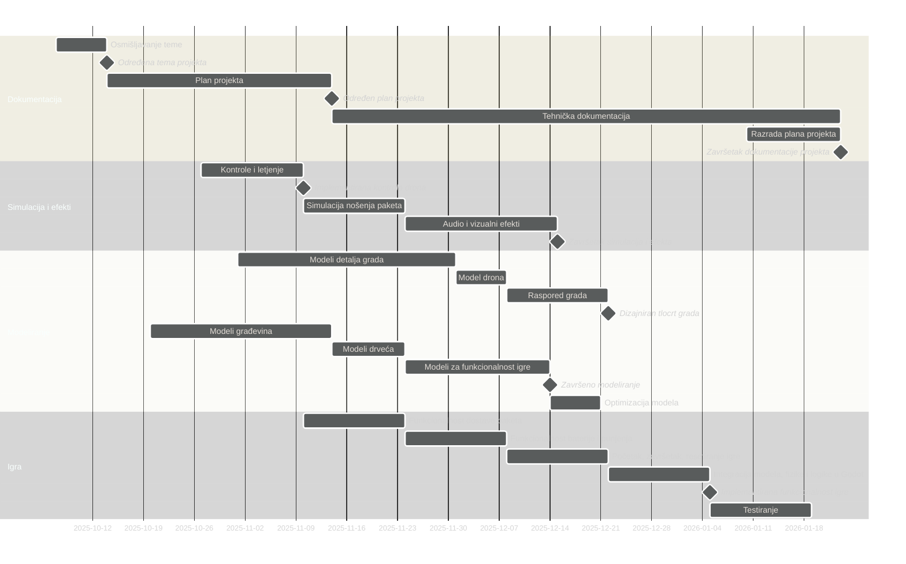

---

> Upute za export grafa u sliku
> 1. Kopirati source kod grafa (sve unutar "mermaid" bloka)
> 2. https://www.mermaidchart.com/play?utm_source=mermaid_live_editor
> 3. `theme: neutral`
> 4. Export

---

---